# Image reference library

Repository artwork uses a blue-and-white palette. Original upstream images retain their source appearance and location.

## Repository overview

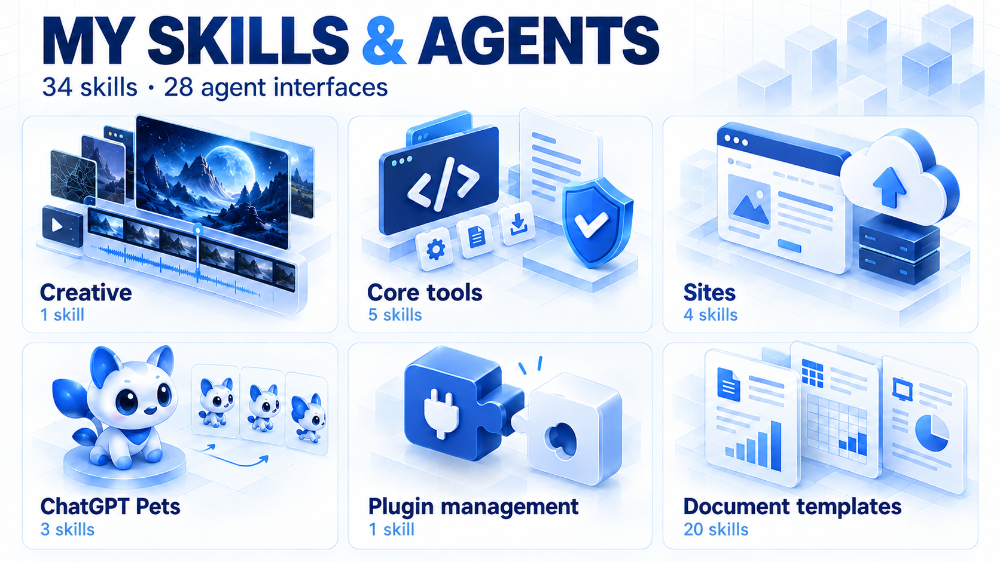

**34 skills · 28 agent interfaces · 1672 × 941 PNG.** Generated with the built-in imagegen tool on October 5, 2026.

| Resource | Location |
| --- | --- |
| Final overview | [PNG](../assets/images/generated/skills-overview-blue-white-v1.png) |
| Generation prompt | [Prompt](../assets/images/prompts/skills-overview-blue-white-v1.txt) |
| Palette correction | [Edit prompt](../assets/images/prompts/skills-overview-blue-white-v1-correction.txt) |
| Provenance and checksum | [Metadata](../assets/images/metadata.json) |

The artwork illustrates Creative (1), Core tools (5), Sites (4), ChatGPT Pets (3), Plugin management (1), and Document templates (20). See the [skill catalog](CATALOG.md) for the complete inventory.

## Creative reference

Original material and lighting reference for `dark-tech-cover`. This reference retains its original dark appearance; the repository cover uses the requested blue-and-white palette.

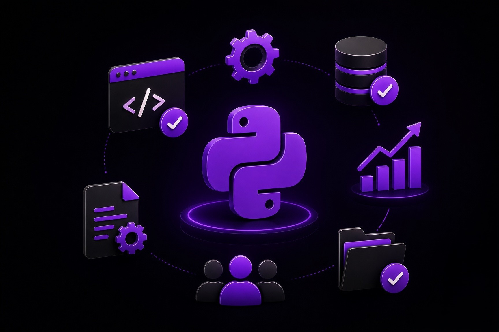

[Source file](../skills/custom/dark-tech-cover/assets/reference-python-cover.jpg)

## Document template previews

These original preview images accompany the 20 template skills. Their reference documents stay in the same package assets directories.

| Template skill | Preview |
| --- | --- |
| [Analytics Dashboard](../plugins/openai-templates/0.1.1/skills/artifact-template-analytics-dashboard/SKILL.md) | 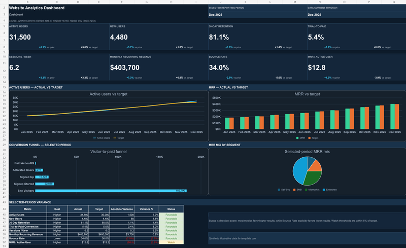 |
| [Business Review](../plugins/openai-templates/0.1.1/skills/artifact-template-business-review/SKILL.md) | 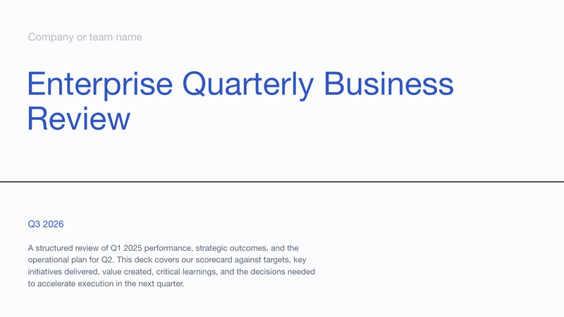 |
| [Design Report](../plugins/openai-templates/0.1.1/skills/artifact-template-design-report/SKILL.md) | 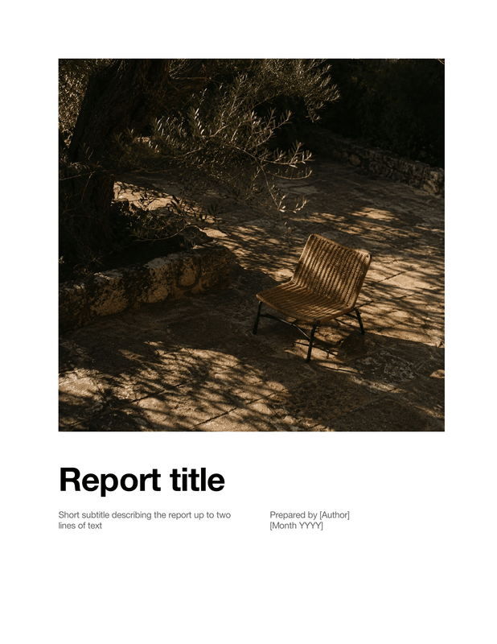 |
| [Experiment Analysis](../plugins/openai-templates/0.1.1/skills/artifact-template-experiment-analysis/SKILL.md) | 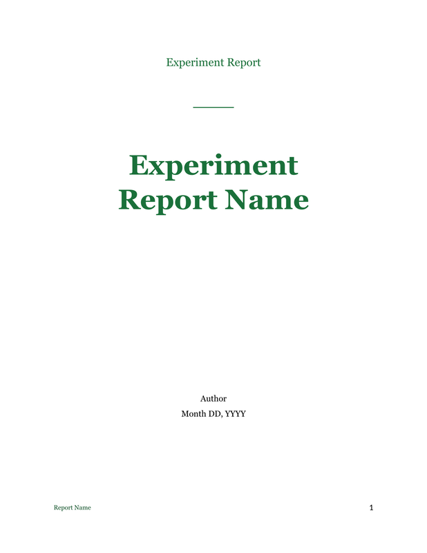 |
| [Financial Budget](../plugins/openai-templates/0.1.1/skills/artifact-template-financial-budget/SKILL.md) | 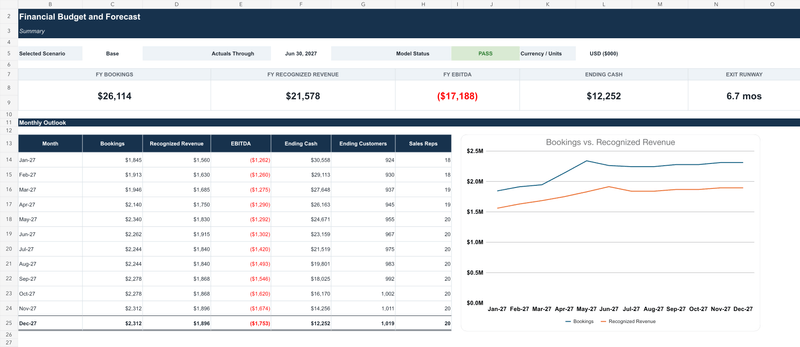 |
| [Investment Committee Memo](../plugins/openai-templates/0.1.1/skills/artifact-template-investment-committee-memo/SKILL.md) |  |
| [Legal Memorandum](../plugins/openai-templates/0.1.1/skills/artifact-template-legal-memorandum/SKILL.md) | 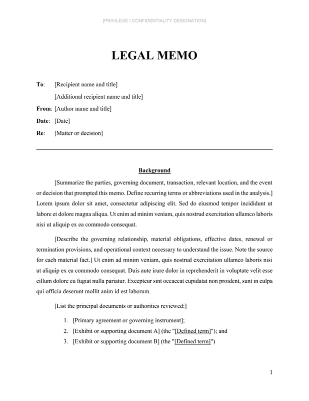 |
| [Market Trends Report](../plugins/openai-templates/0.1.1/skills/artifact-template-market-trends-report/SKILL.md) | 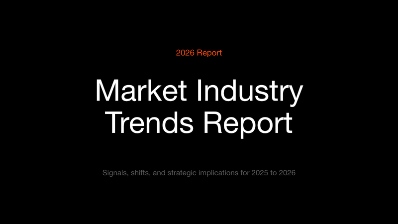 |
| [Minimal Letterhead](../plugins/openai-templates/0.1.1/skills/artifact-template-minimal-letterhead/SKILL.md) | 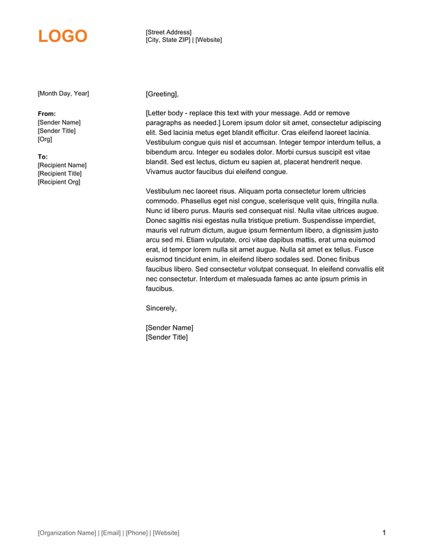 |
| [Operating Calendar](../plugins/openai-templates/0.1.1/skills/artifact-template-operating-calendar/SKILL.md) | 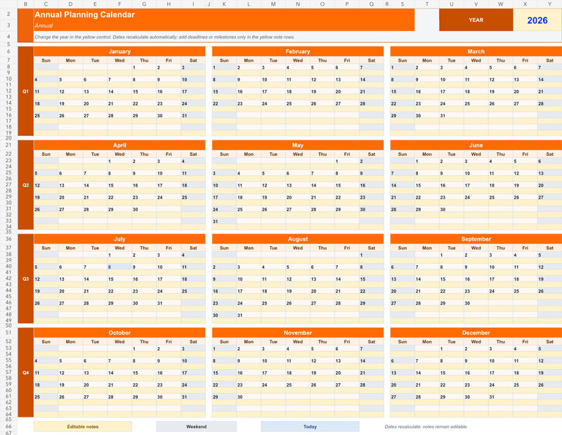 |
| [Operating Review](../plugins/openai-templates/0.1.1/skills/artifact-template-operating-review/SKILL.md) | 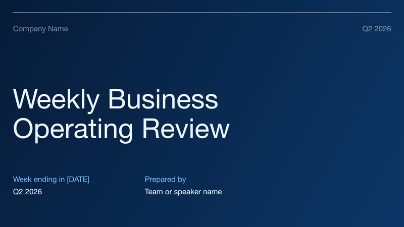 |
| [Project Kickoff](../plugins/openai-templates/0.1.1/skills/artifact-template-project-kickoff/SKILL.md) | 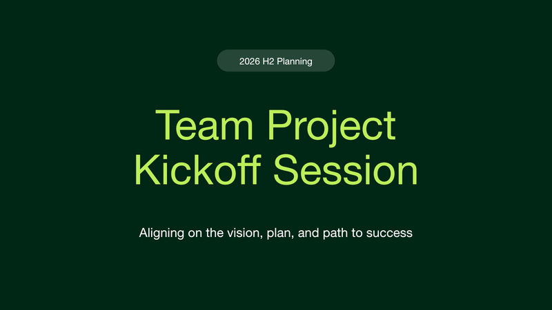 |
| [Project Tracker](../plugins/openai-templates/0.1.1/skills/artifact-template-project-tracker/SKILL.md) | 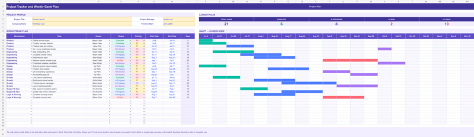 |
| [Sales Pipeline](../plugins/openai-templates/0.1.1/skills/artifact-template-sales-pipeline/SKILL.md) | 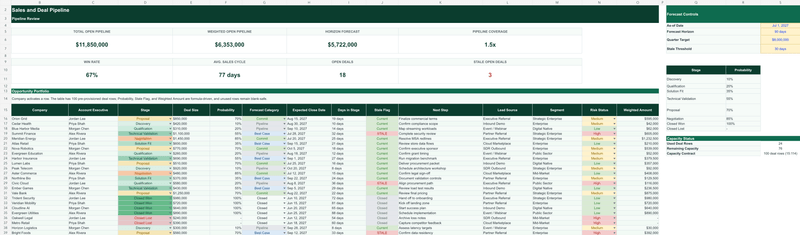 |
| [Simple Dark Mode](../plugins/openai-templates/0.1.1/skills/artifact-template-simple-dark-mode/SKILL.md) | 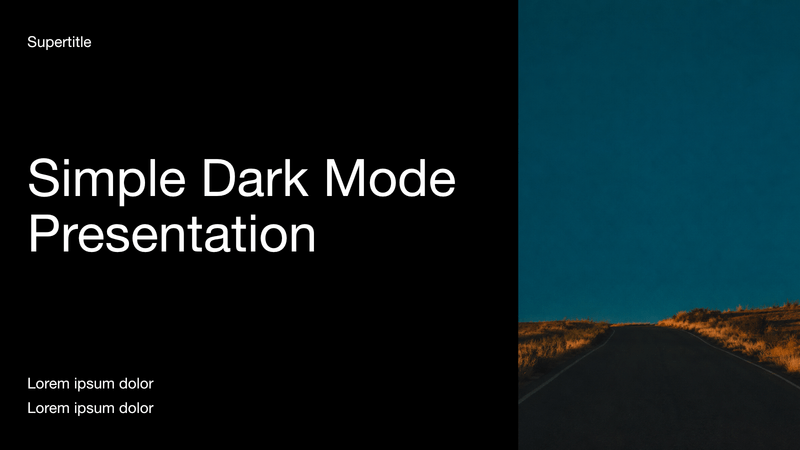 |
| [Simple Light Mode](../plugins/openai-templates/0.1.1/skills/artifact-template-simple-light-mode/SKILL.md) | 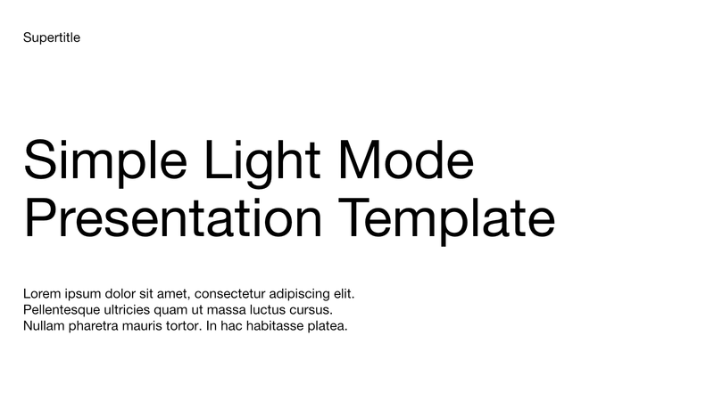 |
| [Strategy Memorandum](../plugins/openai-templates/0.1.1/skills/artifact-template-strategy-memorandum/SKILL.md) |  |
| [System Design](../plugins/openai-templates/0.1.1/skills/artifact-template-system-design/SKILL.md) | 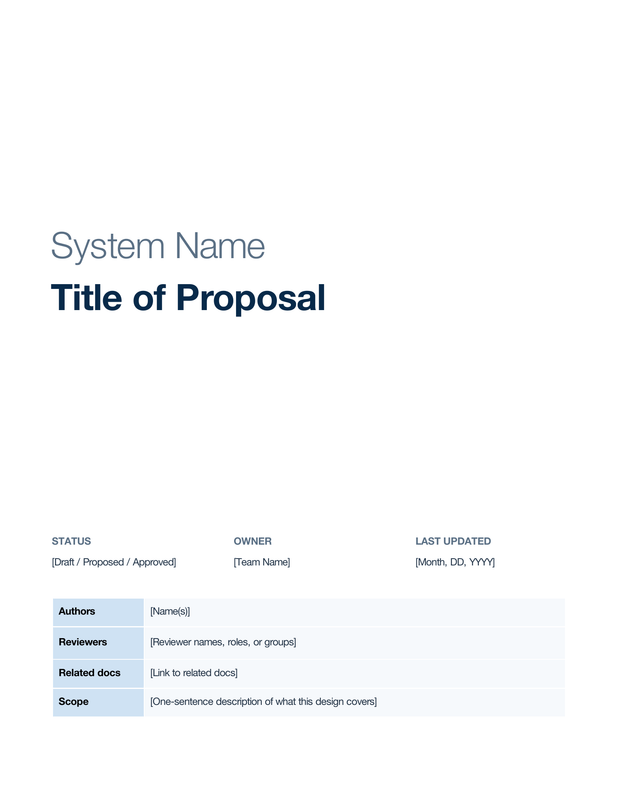 |
| [Team Alignment](../plugins/openai-templates/0.1.1/skills/artifact-template-team-alignment/SKILL.md) | 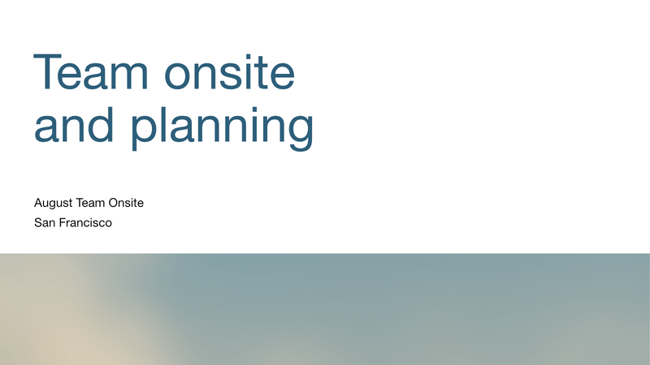 |
| [Three Statement Forecast](../plugins/openai-templates/0.1.1/skills/artifact-template-three-statement-forecast/SKILL.md) | 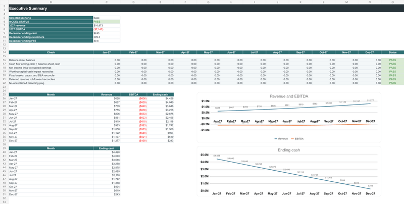 |

## Package icons and supporting images

Original interface icons and supporting images are indexed here without duplicating them.

| Image | Original package path |
| --- | --- |
| imagegen-small.svg | [View image](../skills/system/imagegen/assets/imagegen-small.svg) |
| imagegen.png | [View image](../skills/system/imagegen/assets/imagegen.png) |
| openai-small.svg | [View image](../skills/system/openai-docs/assets/openai-small.svg) |
| openai.png | [View image](../skills/system/openai-docs/assets/openai.png) |
| skill-creator-small.svg | [View image](../skills/system/skill-creator/assets/skill-creator-small.svg) |
| skill-creator.png | [View image](../skills/system/skill-creator/assets/skill-creator.png) |
| skill-installer-small.svg | [View image](../skills/system/skill-installer/assets/skill-installer-small.svg) |
| skill-installer.png | [View image](../skills/system/skill-installer/assets/skill-installer.png) |
| icon.svg | [View image](../plugins/openai-templates/0.1.1/assets/icon.svg) |
| plugin-management.svg | [View image](../plugins/plugin-management/0.1.0/assets/plugin-management.svg) |
| icon.svg | [View image](../plugins/sites/0.1.75/assets/icon.svg) |
| logo.svg | [View image](../plugins/sites/0.1.75/assets/logo.svg) |
| favicon.svg | [View image](../plugins/sites/0.1.75/skills/sites-building/templates/vinext-starter/public/favicon.svg) |
| file.svg | [View image](../plugins/sites/0.1.75/skills/sites-building/templates/vinext-starter/public/file.svg) |
| globe.svg | [View image](../plugins/sites/0.1.75/skills/sites-building/templates/vinext-starter/public/globe.svg) |
| window.svg | [View image](../plugins/sites/0.1.75/skills/sites-building/templates/vinext-starter/public/window.svg) |
| egg.svg | [View image](../plugins/work-pets/0.1.6/assets/egg.svg) |

## Maintenance

Run `python scripts/catalog_images.py` after refreshing the skill inventory or replacing the overview artwork. Preserve original package paths and bundled source terms. The generated cover checksum is recorded in `assets/images/metadata.json`; archived image checksums are recorded in `inventory.json`.
